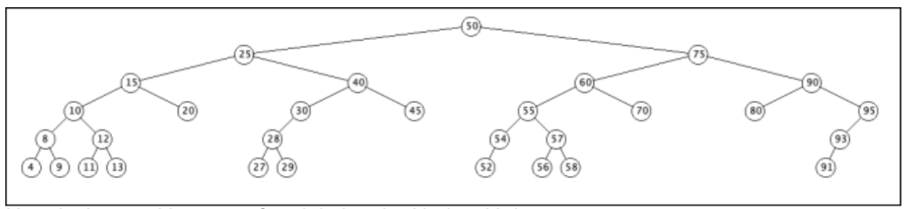
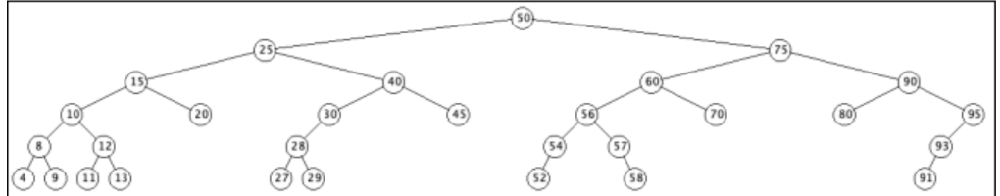
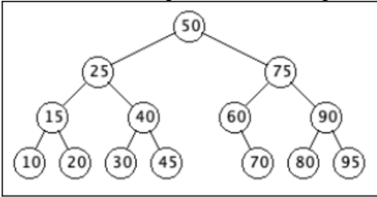

------------------------------------------------
Programming Assignment 05 - Due 3/26 by 11:59 pm
------------------------------------------------

## Description

**CAUTION:** This one will probably be hard to implement and get all the details nailed. I recommend starting this particular assignment early. Come to office hours if you get lost in the implementation details.

For this programming assignment, we will be implementing a binary search tree (BST). We have discussed each of the functions that a binary search tree has, during class. [You can brush up on the details here for reference.](https://github.com/Binghamton-University-CS140-Spring-2023/lecture_notes/blob/main/22_binary_search_trees.md)

### Supporting Duplicate Keys

Our binary search tree will support ***duplicate keys***. Duplicate keys impacts two methods in the binary search tree and one method in the `Node` class. 

1. For the `insert()` method, you should first search to see if the key already exists in the tree using the `getNode()` method. 
- If it already exists, then simply ***increment the count by one*** for the associated `Node`. 
- If it doesn't exist, then insert a new `Node` with a ***count of one*** into the tree. 

2. For the `delete()` function:
- If the `Node` has a count greater than one, then simply ***decrement the count by one***. 
- If the `Node` has a count of one, then ***delete*** the `Node`. 

3. For the `Node` class, we will update the `toString()` method ***to include the count*** of the `Node`. 
- The `count` will be added after the ***right key*** and prior to the right parenthesis, and should have a comma delimiter between the right key and the `count`.

## Start Source Files

The following files have been provided as a starting point, in the `src` directory:

| File | Description |
| ---- | ----------- |
| `BinarySearchTree.java` | skeleton of the BST you will be implementing |
| `BinarySearchTreeFunctions.java` | interface describing all the functionality your BST needs to implement |
| `Node.java` | skeleton of the Node you will be implementing, which is used to build up the BST |
| `NodeFunctions.java` | interface describing all the functionality your Node class needs to implement |

## Start Test Files

Additionally, the following will make your life a little easier with Debugging your BST, in the `testing` directory:

| Test File | Description |
| --------- | ----------- |
| `drawBinarySearchTree.java` | Utility executable that helps you draw your BST and visually display it for debugging purposes. |
| `DrawingArea.java` | Needed to graphically represent the BST in the debug executable. |

## Import your repo to eclipse

You will want to import Programming Assignment 05 into eclipse, and be sure to add ***JUnit5*** as a library, so that the test code from lab08 can build. We have covered how to do this in previous assignments, refer back to those if needed.

---------------------------------
Lab 08 - Due 3/14 by 11:59 pm
---------------------------------

Time to take a quick detour. Lab08 is all about implementing some JUnit tests, to help you ensure that your `BinarySearchTree` class is being implemented correctly. For lab08, [please do all the details specified here](lab08/README.md), then push up your changes to github. The commit hash on BrightSpace should correspond to what you finish by the end of lab08:

```
git add -A
git commit -m "finished lab08. rest of program assignment 5 to come later" 
git push
git rev-parse HEAD
```

To be clear here, lab08 will be completely captured and graded here, in the program assignment 05 repository. There is no separate lab08 repository. Your grade for program assignment 05 will also be based upon this repository, just for another commit hash that you will submit later on, when you finish it in its entirety. 

If you finish lab08 early in lab, you may continue on to implement the rest of programming assignment 05. See below.

# STOP! Do not continue below until you have finished lab 08 above

## Program Assignment 05 Requirements

We will be implementing two classes:

1. `Node`, which implements the `NodeFunctions` interface.
2. `BinarySearchTree`, which implements `BinarySearchTreeFunctions` interface.

You should name your `BinarySearchTree` class`your_last_name_in_lower_case_BinarySearchTree`.

3. By the end of the your implementation, all the JUnit tests established in lab08 should pass at a minimum.
    - You are free to add more testing as you see fit.
    - Note that currently, there are no tests for the `updateNode()` method for instance.
    - Insertions and Deletions should probably be tested more as well.

## Rogue Node import that could cause you issues

Eclipse has added `import.org.w3c.dom.Node;` to my `BinarySearchTree` class multiple times, so if you suddenly start getting numerous `Node` related errors, check to see if that import is in your file, then remove it.

## Todos and Java docs provided

To provide clarity, I have added javadocs describing each of the methods you will be implementing. I also added TODOs throughout to help point out what needs to be implemented.

## Interfaces

The two interfaces are:

1. `NodeFunctions`

``` java
interface NodeFunctions
{
    /**
     * Returns the key value stored within the current node.
     * 
     * @return the internally held key value
     */ 
    public int getKey();

    /**
     * Returns the Node which is the parent of the current Node.
     * 
     * @return the internally held parent Node
     */ 
    public Node getParent();

    /**
     * Returns the Node which is the left child of the current Node.
     * 
     * @return the internally held left child Node
     */ 
    public Node getLeft();

    /**
     * Returns the Node which is the right child of the current Node.
     * 
     * @return the internally held right child Node
     */ 
    public Node getRight();
    
    /**
     * Returns the count, which indicates how many times this Node's held key has been inserted.
     *
     * @return the count of this Node's held key
     */
    public int getCount();

    /**
     * Sets the left child Node of the current Node.
     * 
     * @param Node n - specifies which node will be stored as the left child.
     */ 
    public void setLeft(Node n);

    /**
     * Sets the right child Node of the current Node.
     * 
     * @param Node n - specifies which node will be stored as the right child.
     */ 
    public void setRight(Node n);

    /**
     * Sets the parent Node of the current Node.
     * 
     * @param Node n - specifies which node will be stored as the parent.
     */ 
    public void setParent(Node n);

    /**
     * Returns a string representation of the current Node's state, of the form "(x,y,z,w,c)", where:
     * 
     *  - x is the current Node's key value.
     *  - y is the parent Node's key value.
     *  - z is the left child Node's key value.
     *  - w is the right child Node's key value.
     *  - c is the count of the Node's held key value.
     * 
     * If any of the Nodes are null, then its key value should be reprented via an empty String
     * 
     * Example: "(10,,3,14,2)" 
     * - represents Node with key value 10
     * - whose parent Node is null
     * - whose left child Node has key value 3
     * - whose right child Node has key value 14
     * - whose count is 2, indicating 10 occurs twice 
     *
     * @return String representation of the current Node
     */
    @Override
    public String toString();

    /**
     * Returns whether the current Node is equal to another object.
     * A Node is considered equal to another Node if they have the same key value.
     * 
     * @param Object o - the other object being compared to the current Node for equality.
     *
     * @return true for equality, false otherwise.
     */ 
     @Override 
    public boolean equals(Object o);
}
```

2. `BinarySearchTreeFunctions`

``` java
interface BinarySearchTreeFunctions
{
    /**
     * Getter for the root of the entire BST.
     * 
     * @return the root Node
     */ 
    public Node getRoot();

    /**
     * Setter for the root of the entire BST.
     * 
     * @param Node root - specifies the new root Node of the BST.
     */ 
    public void setRoot(Node root);

    /**
     * Inserts a Node into the BST.
     * If a Node exists in the BST with the same key as Node z, then we increment that Node's count.
     * 
     * @param Node z - specifies the new Node to be added to the BST.
     */ 
    public void insertNode(Node z);

    /**
     * Traverses and prints the BST, performing a pre-order walk.
     * 
     * Recall a pre-order walk involves visiting:
     *      1. Ourselves (x)
     *      2. Our left subtree 
     *      3. Our right subtree
     * 
     * @param Node x - specifies which Node we are currently viewing as the relative root as we perform the pre-order traversal.
     */ 
    public void preOrderWalk(Node x);

    /**
     * Traverses the BST, peforming a pre-order walk.
     * When the pre-order traversal is complete, the list passed in will be fully populated with information pertaining 
     * to the order the in which the Nodes were visited.
     * 
     * @param Node                        x     - specifies which Node we are currently visiting 
     *                                            as the relative root as we perform the pre-order traversal.
     * @param java.util.ArrayList<String> list  - a list of Strings that will be populated based upon
     *                                            the order in which the Nodes are visited.
     */ 
    public void preOrderWalk(Node x, java.util.ArrayList<String> list);

    /**
     * Traverses and prints the BST, performing an in-order walk.
     * 
     * Recall an in-order walk involves visiting:
     *      1. Our left subtree
     *      2. Ourselves (x)
     *      3. Our right subtree
     * 
     * @param Node x - specifies which Node we are currently viewing as the relative root as we perform the in-order traversal.
     */ 
    public void inOrderWalk(Node x);

    /**
     * Traverses the BST, peforming an in-order walk.
     * When the in-order traversal is complete, the list passed in will be fully populated with information pertaining 
     * to the order the in which the Nodes were visited.
     * 
     * @param Node                        x     - specifies which Node we are currently visiting 
     *                                            as the relative root as we perform the in-order traversal.
     * @param java.util.ArrayList<String> list  - a list of Strings that will be populated based upon
     *                                            the order in which the Nodes are visited.
     */ 
    public void inOrderWalk(Node x, java.util.ArrayList<String> list);

    /**
     * Traverses and prints the BST, performing a post-order walk.
     * 
     * Recall a post-order walk involves visiting:
     *      1. Our left subtree
     *      2. Our right subtree
     *      3. Ourselves (x)
     * 
     * @param Node x - specifies which Node we are currently viewing as the relative root as we perform the post-order traversal.
     */ 
    public void postOrderWalk(Node x);

    /**
     * Traverses the BST, peforming a post-order walk.
     * When the post-order traversal is complete, the list passed in will be fully populated with information pertaining 
     * to the order the in which the Nodes were visited.
     * 
     * @param Node                        x     - specifies which Node we are currently visiting 
     *                                            as the relative root as we perform the post-order traversal.
     * @param java.util.ArrayList<String> list  - a list of Strings that will be populated based upon
     *                                            the order in which the Nodes are visited.
     */ 
    public void postOrderWalk(Node x, java.util.ArrayList<String> list);

    /**
     * Returns the Node which is the maximum descendant of the specified Node.
     * By maximum descendant, we mean some Node which:
     *      1. has the largest possible key value 
     *      2. is contained within a subtree (in particular the right subtree) of the specified Node
     * 
     * If the specified Node has no descendant with a larger key, return x itself.
     * 
     * @param Node x - specifies which Node we wish to start from while searching for his maximum descendant
     * 
     * @return the maximum descendant of the specified Node (which may be itself)
     */ 
    public Node getMax(Node x);

    /**
     * Returns the Node which is the minimum descendant of the specified Node.
     * By minimum descendant, we mean some Node which:
     *      1. has the smallest possible key value 
     *      2. is contained within a subtree (in particular the left subtree) of the specified Node
     * 
     * If the specified Node has no descendant with a smaller key, return x itself.
     * 
     * @param Node x - specifies which Node we wish to start from while searching for his minimum descendant
     * 
     * @return the minimum descendant of the specified Node (which may be itself)
     */ 
    public Node getMin(Node x);

    /**
     * Returns the Node which is the successor of the specified Node.
     * By successor, we mean some Node whose key value is the least upper bound of the specified Node's key.
     * 
     * If the specified Node has no successor, return null.
     * 
     * @param Node x - specifies which Node we wish to start from while searching for his successor.
     * 
     * @return the successor of the specified Node (which may be null)
     */ 
    public Node getSuccessor(Node x);

    /**
     * Returns the Node which is the predecessor of the specified Node.
     * By predecessor, we mean some Node whose key value is the greatest lower bound of the specified Node's key.
     * 
     * If the specified Node has no predecessor, return null.
     * 
     * @param Node x - specifies which Node we wish to start from while searching for his predecessor.
     * 
     * @return the predecessor of the specified Node (which may be null)
     */ 
    public Node getPredecessor(Node x);

    /**
     * Attempts to find and return the Node, starting from x, which holds the specified key.
     * 
     * If the specified key doesn't correspond to some Node that is a descendant of x, return null.
     * 
     * @param Node x   - specifies which Node we wish to start from while searching for the node
     * @param int  key - the key value indicating which Node we are attempting to find
     * 
     * @return the Node whose key value matches the key we specified (may be null if not found)
     */ 
    public Node getNode(Node x, int key);

    /**
     * Determines and returns the height of some subtree of the BST, starting from x as the relative root Node.
     * 
     * Note: To determine the height of the entire BST, we would pass the actual root of the entire BST to this method.
     * 
     * @param Node x - specifies which Node we wish to start from while determing the height.
     * 
     * @return the height of the subtree which starts from the relative root
     */ 
    public int getHeight(Node x);

    /**
     * Helper method which replaces one Node, namely u, with another Node, namely v.
     * This method is only used by the deleteNode function.
     * 
     * By "replace", we mean that Node v is treated as if it resided where u was all along. In other words:
     *      1. Parent: v's parent will be updated to point at what u's parent was
     *      2. Child:  u's parent will treat v as its child, pointing to v where it used to point to u. 
     */ 
    public void shiftNode(Node u, Node v);

    /**
     * Attempts to find and delete a Node from the BST.
     * If the specified Node cannot be found in the BST, then this function should not alter the BST.
     * 
     * If the specified Node can be found in the BST, but has a count greater than 1, we simply decrement the Node's count.
     * Otherwise, we truly need to perform a deletion.
     *
     * Upon deleting the Node, is it required that the BST maintains the search property and is connected after the deletion.
     * 
     * By search property, we mean that for any given Node in the BST:
     *      1. all his left descendants (those in his left subtree) have strictly smaller key values
     *      2. all his right descendants (those in his right subtree) have strictly greater key values
     * 
     * @param Node z - the node to be found and then removed from the BST.
     */ 
    public void deleteNode(Node z);
}
```

## Testing

When I test your program, I'll be testing all of the BST functions that we convered and are included in the `BinarySearchTreeFunctions` interface.

The testing will be something along the following:

1. Add a collection of keys to an initially empty tree, including duplicate keys (the duplicate keys should cause the corresponding Nodes to have counts greater than one.)
2. Verify that the tree is correct
3. Check the tree height
4. Check the max and min
5. Check the in order walk
6. Check the pre order walk
7. Check the post order walk
8. Check if some keys can be found in the tree
9. Check some predecessors of nodes in the tree
10. Check some successors of nodes in the tree
11. Delete some nodes from the tree
12. Verify the tree is correct
13. Add a collection of keys to the tree
14. Verify the tree is correct
15. Verify the count is correct for all of the nodes in the tree.

When I test your BST, I will be using my own copy of `Node.java`, so make sure that you are using the getters and setters to access the fields. The fields of your `Node` class should all be ***private*** and should not be accessed directly by any code outside of the `Node` class.

If each of your BST functions work properly, then they should work together without any issues. The three functions that require the most testing are `insertNode`, `deleteNode`, and `shiftNode`. (`shiftNode` should get tested via `deleteNode` testing).

## Some concrete examples

### Example 1

Here is an initially empty tree after adding key 50:


Here is the tree after adding key 25:


Here is the tree after adding key 75:


Here is the tree after adding key 15:


Here is the tree after adding key 40:


### Example 2

Here is an initially empty tree after adding keys: 
 - 50 25 75 15 40 60 90 10 20 30 45 55 70 80 95 8 12 28 4 9 11 13 27 29 54 57 52 56 58 93 91



Here is the resulting tree after deleting the Node with key 55:



Here is the resulting tree after deleting the Node with key 40:


Here is the resulting tree after deleting the Node with key 15:


Here is the resulting tree after deleting the Node with key 25:


Here is the resulting tree after deleting the Node with key 80:


Here is the resulting tree after deleting the Node with key 50:


### Example 3 - smaller example involving deletion

Here's a smaller example of a BST that we delete the same nodes from. We start with the tree with keys added in the following order:
- 50 25 75 15 40 60 90 10 20 30 45 55 70 80 95


Here is the resulting tree after deleting the Node with key 55:



Here is the resulting tree after deleting the Node with key 40:


Here is the resulting tree after deleting the Node with key 15:


Here is the resulting tree after deleting the Node with key 25:


Here is the resulting tree after deleting the Node with key 80:


Here is the resulting tree after deleting the Node with key 50:


## Description of Additional Debugging Tools 

- You will notice in the BST skeleton, we have included an implementation of the `preOrderWalk()` methods that came from the interface.
- We also provided an additional `preOrderWalk(Node x, String id, java.util.ArrayList<String> result)` method.
    - It is used by the tree drawing tool `drawBinarySearchTree.java` and testing program `testBinarySearchTree.java`. 
    - It exists purely for debugging purposes. 

### Utilizing the DrawBinarySearchTree executable 

The `drawBinarySearchTree.java` program allows you to:
- create a binary search tree and populated it with the keys provided on the command line
- and draw it on the screen. 

Once the window shows up on the screen, each time you press a key it will ***add*** or ***delete*** a node with the next key value. 
- The commandline parameters are a list of key values and the letters "a" and "d". 
    - An "a" tells the program to add nodes 
    - A  "d" tells the program to delete keys 
    - **Note:** By default, nodes are added. 
- Each time an "a" or "d" is entered, the program will continue adding or deleting notes until another "a" or "d" is included in the list of nodes. 

#### A Test Drawing Example ####

The following will ***add*** nodes with keys `30, 20, 40, 15, 10`, ***delete*** nodes with keys `10` and `15`, and then ***add*** nodes with keys `55` and `60`.
```
java drawBinarySearchTree 30 20 40 15 10 d 10 15 a 55 60
``` 

### Some initial work to do before testBinarySearchTree will work

**Note 1:** You will need to update `drawBinarySearchTree.java` to load your implementation of a binary search tree, based on your file name.

**Note 2: Be aware!** The code that has been posted ***should*** compile, but when you execute `drawBinarySearchTree`
with a list of keys, if the `insertNode()` method has not been implemented, the ouput to draw the tree will be empty.

### Advice on your Plan of Attack - How I would tackle it

Similar to the last programming assignment involving Graphs, it is hard to test anything without the basic data structure being able to be built up properly. With that in mind, my advice would be to implement the BST in the following order:

1. Before we can do anything meaningful with constructing the BST itself:
    - We need to make sure our building block is solid. 
    - So, I recommend fully implementing all the details of the `Node` class first.
    - Once you have the `Node` class solid, we can start building our BST.
    - **Note:** For the `equals` method, you may want to refer back to lab07 (regarding Priority Queue) for reference.
        - Recall we implemented an `equals()` method there.
2. The getters and setters involving the root, `getRoot` / `setRoot` should be the easiest to implement.
3. Next, I recommend implementing the `insertNode` method. 
    - This will allow you to start building up BSTs
    - Once BSTs can be built, you can utilize the drawing / test executables provided to see your construction
    - The drawing / test executables may be able to help you ensure your `insertNode` is working the way you expect.
    - Once the `insertNode` is building up BSTs, we have a few options from there.
        - Honestly, 4/5/6/7 below can be done in whichever order you prefer in my opinion.
        - Steps 8/9/10 I do think should be done in ***sequential order***, and probably ***saved for last***.
4. The traversal methods, `preOrderWalk`, `inOrderWalk`, `postOrderWalk` should be relatively straight forward to implement next.
    - the `preOrderWalk` has been provided, so the `inOrderWalk` and `postOrderWalk` should be inspired by that.
    - See how you are progressing with the JUnit tests we wrote in lab08 as well. 
    - Once `insertNode` and `inOrderWalk` are implemented, you should start to get some unit tests passing.
5. The `getNode` method should be somewhat similar to the high level logic involved in our `insertNode` method.
    - High level, we will need to try to find the `Node` we seek in the left or right subtree, based on the key values.
    - This is similar to how the `insertNode` chooses where a new `Node` will be inserted.
6. The `getMax` and `getMin` methods should be a few lines of code.
    - These will be useful for the `getSuccessor` and `getPredecessor` methods.
    - Definitely implement these before those are started.
7. The `getHeight` method is almost standalone as far as implementation details go.
    - Definitely think you should tackle it after you can build up meaningful examples of BSTS (ie after `insertNode`).
    - You could also circle back around to test the height decreases as Nodes are deleted from the BST
        - Luckily, we can at least start testing `getHeight` before the `deleteNode` method is fully implemented.
8. The `getSuccessor` and `getPredecessor` methods will probably be the next to be done since:
    - we need to leverage the `getMax` and `getMin` methods in some cases
    - these will be needed in some of our deletion logic
    - these also have a few tricky edge cases
    - Be sure JUnit tests involving these are passing and everything seems solid, since deletion relies heavily on these being correct.
9. Once the `getSuccessor` and `getPredecessor` seem good, you probably want to implement `shiftNode` next.
    - It is a helper method leveraged by the `deleteNode` function.
    - Want to make sure it is also solid before moving on.
10. We saved the best for last, I highly recommend implementing `deleteNode` after everything else is done.
    - It will be relying on various different methods
        - `shiftNode`, `getSuccessor` for instance.
        - some of these methods rely on other methods as well, `getMax` for example.
        - We can't meaningfully delete nodes from a BST that hasn't been built up yet (ie indirectly dependent on `insertNode` being correct.)

**Disclaimer:** This is just my advice, you can feel free to implement the BST in whatever order you see fit.

### Testing Functionality 

Between the drawing program provided and all the JUnit tests we created in lab08, you should be in good shape for testing that your code is functioning properly. 

**FRIENDLY REMINDER:** This one will probably be hard to implement and get all the details nailed. I recommend starting this particular assignment early. Come to office hours if you get lost in the implementation details.

## Submission

As usual, be sure to push your code up to github, and post your latest commit hash on BrightSpace.

```
git add -A
git commit -m "finished Programming Assignment 5"
git push 
git rev-parse HEAD
```
