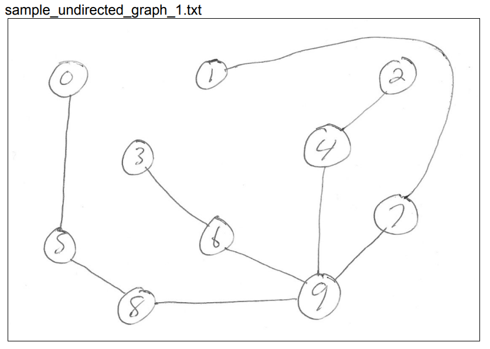
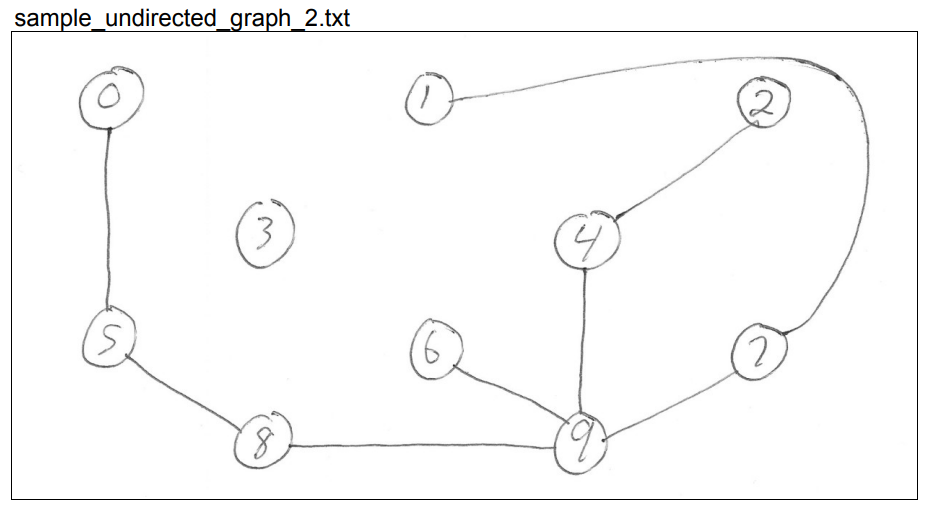
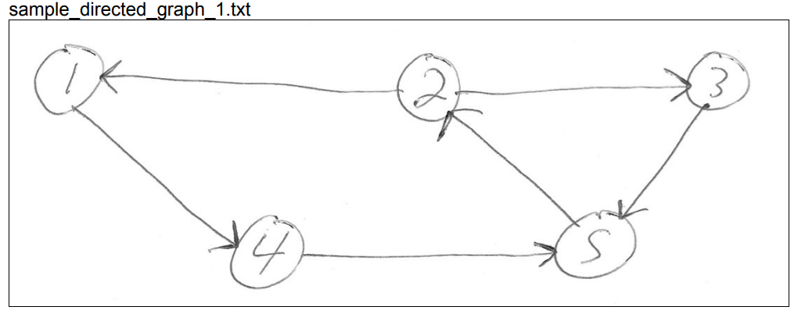
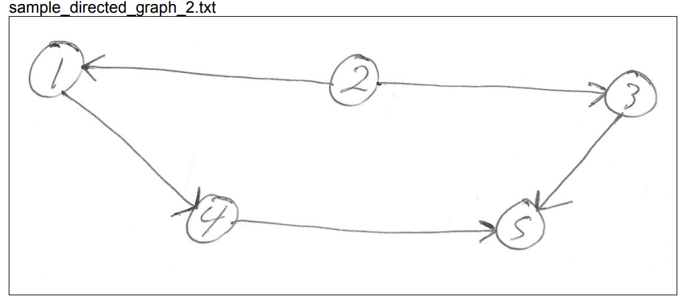

---------------------------------------------------
Program Assignment 04 - Due 3/14 by 11:59 pm
---------------------------------------------------

## Description
 
For programming assignment 4, we will be implementing a `Graph` class that implements the `ConnectedGraphFunctions` interface. Your class and filename will be “your_last_name_in_lower_case_Graph.java” and similarly for the class name. Go ahead and create it, as the `Graph` class has not been provided.

## Start Code

In this repository, we have provded:

1. Edge.java - a record type, representing an edge in our Graph
2. GraphException.java - a custom exception we can throw, related to errors involving our Graph
3. ConnectedGraphFunctions.java - an interface of all the methods we need to implement in our Graph class
4. makeGraph.java - a driver that takes in some graph information via a filename and helps check for connectedness.
5. testGraph.java - the start of some JUnit5 tests, which can be used to ensure your Graph is implemented properly.

## Exception Handling via our GraphException

**Note:** If you take a look, you will see `GraphException` extends the `Exception` class. The constructor takes a `String` representing a message, which passes the `String` to the Exception's constructor via the `super()` syntax. This will cause the exception message to be shown if `GraphException` gets thrown by our program.

Your program should throw a `GraphException` in the following cases:

1. A duplicate vertex is attempted to be added to the `Graph`. 
	- When throwing such an exception, we will not add the duplicate vertex to the Graph. 
2. A duplicate edge is attempted to be added to the `Graph`. 
	- When throwing such an exception, we will not add the duplicate edge to the Graph. 
3. An invalid edge ***(u,v)*** is attempted to be added to the `Graph`.
	- An edge is considered invalid if either of the vertices `u` or `v` do not exist in the Graph's current list of vertices.
	- When throwing such an exception, we will not add the invalid edge to the Graph. 
	
## Caveats with edges - Undirected / Directed Graphs 	

**Note:** Remember that in an ***undirected graph***, the edges ***(u,v)*** and ***(v,u)*** are considered the same. On the other hand, in a ***directed graph***, edges ***(u,v)*** and ***(v,u)*** are not the same (the first represents a one-directional arrow going from vertex `u` to vertex `v`, while the second represents a one-directional arrow going from vertex `v` to vertex `u`). 

The majority of the work for this program will be implementing the `getConnectedSet(int startingVertex)` method, which must work for **both** directed and undirected graphs. We have already discussed an algorithm to determine if a graph is **connected** for undirected graphs or **strongly connected** for directed graphs. 

## Fields for our Graph

For our `Graph` class, we should have three fields, all should be `private` & `final`.

``` java
private final ArrayList<Integer> vertices;    // contains the vertices
private final ArrayList<Edge> edges;          // contains the list of edges
private final boolean isDirected;             // tells us if the graph is or is not directed
```

## Graph Constructors

Your program needs to have two constructors, one that takes no parameters, defaulting to an undirected graph, and one that takes a `boolean` parameter, that specifies if the graph is directed or not. If the `boolean` parameter is `true`, then the graph is considered directed.

**Note:** The default constructor (taking no parameters) should call the other value constructor, specifying `false` for the parameter (this will make it undirected implicitly if the value constructor is implemented properly). 

Recall you can call another constructor in your class via the `this(param1, param2, param3)` syntax, similar to how the `super()` syntax works. (Again, the `GraphException` showcases utilizing a call to the base class constructor).

## Add Empty skeleton implementations 

Your `Graph` class needs to implement the provided interface, `ConnectedGraphFunctions`. 

To do so, define the class `Graph` as follows:

```java
class Graph implements ConnectedGraphFunctions
{

}
```

For each method declared in the `ConnectedGraphFunctions` interface:

Add an implementation of each of these methods in your `Graph` class.

1. For the methods returning `void`, just add an empty function body for now.
2. For the methods returning some `boolean`, just return `false` in the function body for now.
3. For the methods returning some `int`, just return `0` in the function body for now.
4. For the methods returning some `String`, just return the empty string `""` in the function body for now.
5. For the method returning a `HashSet<Integer>`, just return an empty `HashSet<Integer>` in the function body for now.

Take note that the `addEdge()` and `addVertex()` methods indicate they may end up throwing a `GraphException`. You'll account for throwing this Exception later on.

---------------------------------
Lab 06 - Due 2 / 28 by 11:59 pm
---------------------------------

Time to take a quick detour. Lab06 is all about implementing some JUnit tests, to help you ensure that your `Graph` class is being implemented correctly. For lab06, [please do all the details specified here](lab06/README.md), then push up your changes to github. The commit hash on brightspace should correspond to what you finish by the end of lab06:

```
git add -A
git commit -m "finished lab06. rest of program assignment 4 to come later" 
git push
git rev-parse HEAD
```

To be clear here, lab06 will be completely captured and graded here, in the program assignment 04 repository. There is no separate lab06 repository. Your grade for program assignment 04 will also be based upon this repository, just for another commit hash that you will submit later on, when you finish it in its entirety. 

If you finish lab06 early in lab, you may continue on to implement the rest of programming assignment 04. See below.

# STOP! Do not continue below until you have finished lab 06 above

## Description of the isConnected() method

For my implementation of `getConnectedSet(int startingVertex)` I did the following:

1. We need to construct the set of connected vertices, which I called `connectedSubset`, from some starting vertex. I used a `HashSet<Integer>` to keep track of mine.

To create an initially empty `HashSet<Integer>`, utilize the default constructor:

```java
java.util.HashSet<Integer> connectedSubset = new java.util.HashSet<>();
```

**Note:** `HashSet` is an implementation of a set, so it only has unique elements, just like a real set

I typically check if an element is already contained in the HashSet using the `HashSet.contains()` method, so I never actually add any duplicates into my HashSet. (And recall we want throw a `GraphException` if we encounter a duplicate vertex).

2. You can use:

``` java	
connectedSubset.add(startingVertex);
```

to add the starting vertex to the empty set of vertices connected to the starting vertex.

3. I also used an `ArrayDeque<Integer>`, as a queue, to keep track of when vertices were initially added to the connected vertices set.

``` java
java.util.ArrayDeque<Integer> newlyAddedVertices = new java.util.ArrayDeque<>();
```

When I checked if a vertex was in our set `connectedSubset`, if the vertex was not in `connectedSubset`, then it was added to **both** our set `connectedSubset` and our queue `newlyAddedVertices`.

4. **Recall:** The algorithm we described in class takes each vertex added to the set of connected vertices, `connectedSubset`, and checks if there are any edges from the vertex that go to other vertices that are not in the connected vertices set, and if there are, they are added to both the connected vertices set and to the newly added vertices queue.

**Efficiency:** The newly added vertices queue is used to limit the number of times that we search the list of edges for a vertex to a single time.

## Pseudo code

Below is pseudo code for the algorithm. You may want to take liberties with the control flow below, which you are absolutely allowed to do. The goal is just to give you a high level idea of what you need to do.


```java
// Define and initialize the connected set of vertices, connectedSubset, and 
// the queue of newly added vertices, newlyAddedVertices
java.util.HashSet<Integer> connectedSubset = new java.util.HashSet<>();
java.util.ArrayDeque<Integer> newlyAddedVertices = new java.util.ArrayDeque<>();
connectedSubset.add(startingVertex);
newlyAddedVertices.add(startingVertex);

while(newlyAddedVertices is not empty):
	// get the first element from newlyAddedVertices
	// This will get the first element from newlyAddedVertices and also remove it from newlyAddedVertices
	int currentVertex = newlyAddedVertices.pollFirst();


	// The vertex is removed above, since we only want to do the below once for each 
	// vertex that is added to the connected vertices set

	Loop over all of the edges in our Graph:
		//Note: we should only be dealing with Case 1 or Case 2, depending on if our graph is directed or undirected.

		//CASE 1: dealing with an undirected graph

		//For an undirected graph, if currentVertex is one of the vertices contained in
		//the current edge, then check if the other vertex of the edge is in connectedSubset

		If it is not contained in connectedSubset:
			//Add it to connectedSubset and to newlyAddedVertices

		//CASE 2: dealing with a directed graph
		//For a directed graph, if currentVertex is the from vertex contained in the
		//current edge, then check if the to vertex of the edge is in connectedSubset

		If it is not contained in connectedSubset:
			//Add it to connectedSubset and to newlyAddedVertices

return connectedSubset; //contains all of the vertices of the graph that can be reached via a path from startingVertex.

//Note 1: To determine connectedness, check if the connected vertices set being returned, connectedSubset, contains all of the vertices of the graph.

// Note 2: Since we do not allow duplicate vertices, you can just check if the size of the vertices
// ArrayList has the same size as the connected vertices set, connectedSubset
```		

## Few more things to consider

If a duplicate vertex is attempted to be added to the graph, your code should throw a `GraphException` and not add the duplicate vertex. Keep in mind the other cases in which we throw a `GraphException`, mentioned above.

For an ***undirected graph***, the above pseudo code will will give you the vertices that can be reached from the starting vertex. This can be used to deduce if the graph is connected, by simply checking if the returned `connectedSubset` contains all of the vertices of the graph.

## Dealing with the Directed Graph

For a ***directed graph***, you need to do the following:

1. Use the above pseudo code to get the set of all vertices that have a path from the starting vertex.

2. Do the same, but this time ***reverse all of the edges***, to get a set of all vertices that have a path to the starting vertex.

3. Once you have one set of vertices that have a path from the starting vertex and another set of the vertices that have a path to the starting vertex, the intersection of the two is the set of vertices that is connected to the starting vertex.
	- **Note:** To compute the intersection, I simply did an enhanced for loop over one set of vertices, checking if the currect vertex is in the other set, and if it was, I added it to an initially empty set containing the intersection of the two sets.

4. For my code, I made a helper method: `private java.util.HashSet<Integer> getConnectedSet(int 
startingVertex, ArrayList<Edge> edges)`, and then called this from my `public 
boolean getConnectedSet(int startingVertex)` method, passing the appropriate list of vertices to `getConnectedSet(int startingVertex, ArrayList<Edge> edges)`.
	- For a directed graph, there are two calls to the private helper `getConnectedSet(int startingVertex, ArrayList<Edge> edges)`, one with the ***original edges*** and one with the ***reversed edges***.
	- For an undirected graph, there is one call to the private heloer `getConnectedSet(int startingVertex, ArrayList<Edge> edges)` with the ***original edges***

## Implementing the isConnected() method ## 

The `isConnected(int startingVertex)` method can simply call the `getConnectedSet(int startingVertex)` and if the returned set is the same size as the vertex list, then the graph is connected for an undirected graph or strongly connected for a directed graph.
	- **Note:** This assumes that the list of vertices does not have any duplicate vertices, which you should be ensuring is the case when `addVertex()` is being implemented.

## Some other things to remember

1. `HashSet` and `ArrayDeque` have an `add()` method to add an element, use this to add a vertex to them.
2. `HashSet` has a `contains()` method to check if something is contained in the `HashSet`.
3. `ArrayDeque` has a `pollNext()` method that returns the first element in the `ArrayDeque` and also removes it.
4. `HashSet` and `ArrayDeque` have a `size()` method to get the size of the `HashSet` or `ArrayDeque`.
5. The `Edge` record has methods to get the from vertex, `fromVertex()`, and the to vertex, `toVertex()`, of the edge.
	- **Recall:** The methods are automatically provided by the compiler, since `Edge` is a record.

6. `ArrayList` has a `get(int idx)` method to return the `ArrayList` element at index `idx`.

You can use this with a for loop to loop over the elements of the `ArrayList` of edges:

```java	
for( int j = 0; j < edges.size(); j++ )
{
	Edge currentEdge = edges.get(j);
	// put code here to work with the current edge
}
```
Or you can use the enhanced for loop:
```java
for( Edge currentEdge : edges )
{
	// put code here to work with the current edge
}
```

## Implementing the toString() method for our Graph class

The Graph.toString() method is to return the following:

1. Line 1 is to be `G = (V, E)`
2. Line 2 is to be `V = {v1, v2, v3, … ,vn}`, where `v1` through `vn` are the vertices of `G`.
	- **Note:** The vertices are to be listed in the same order they are added. This should be the natural ordering.
3. Line 3 is to be `E = {(u1, v1),(u2, v2), … , (uk, vk)}`, where (`u1`,`v1`) through (`uk`, `vk`) are the edges of `G`.
	- **Note:** The edges are to be listed in the same order they are added. This should be the natural ordering.

## Building the toString's return value efficiently via the StringBuilder class

You should use a `StringBuilder` to build the output of `toString()`, since at least one of my graphs will be fairly large, and appending to an unmutable String will be slow. You can use the `StringBuilder.append()` and `StringBuilder.toString()` methods to build the string and return it.

## Sample graphs provided.

**Recall:** I have also posted four small sample graphs, two undirected and two directed. Below are the corresponding pngs.
You can find the sample text files representing these graphs in the `samples` directory.







## Ensure all 19 test cases pass

**Recall:** We spent a lot of time implementing unit tests to extensively test our `Graph` class. Part of your grade will depend
on you passing all 19 tests that were implemented during lab06.

## Submission

Submit your work via github and be sure to post the latest commit hash on BrightSpace:

```
git add -A
git commit -m "finished program assignment 4"
git push
git rev-parse HEAD
```
