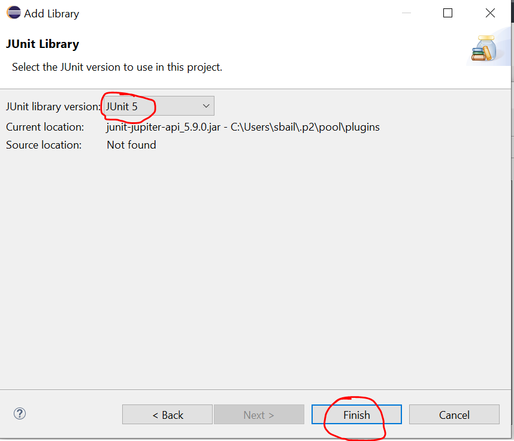
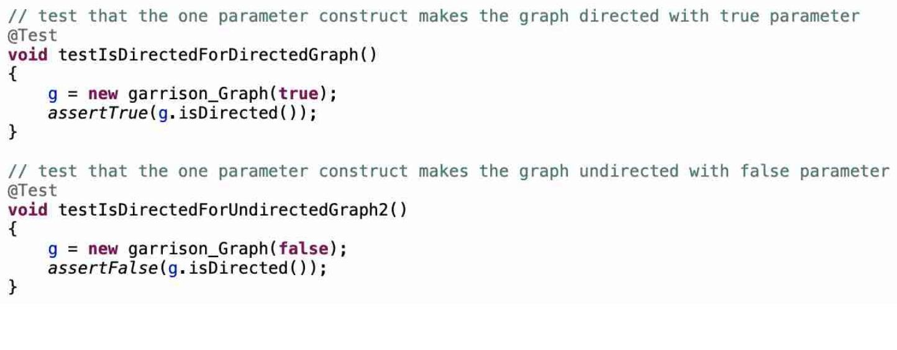
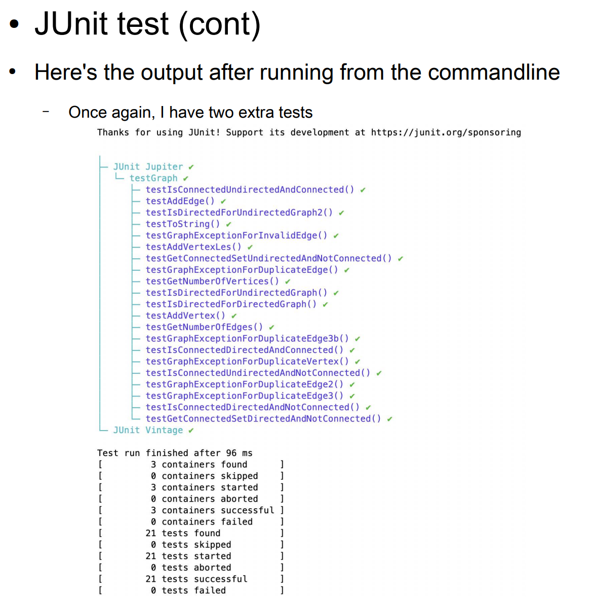

---------------------
Lab06
---------------------

## Description

For lab06, we will be creating a JUnit5 test for all of the methods being implemented in program assignment 4. 

Most of the tests are reasonably adequate, except for the tests for `isConnected()` and `getConnectedSet()`, and that is due to the lack of comprehensive sample graphs.

For the lab, my preference is that everyone uses **eclipse** to create the JUnit5 tests, but I am OK with doing it outside of eclipse with compiling and running the test on the commandline.

## Requirements

To complete the lab, the following is required:

1. At a minimum, you should have a shell of all the required `Graph` class methods.
2. At a minimum, you should have all of the JUnit tests implemented in a JUnit5 test file.
	- I have provided some code for some of the JUnit tests.
3. You should have at least one test passing.
	- The `isDirected()` tests should be really easy to get passing.
4. Once you have the minimum working, continue working on your `Graph` class until close to the end of the activity section.

## Lab Motivation

This lab may seem more like a typing lab than a programming lab. The hope is that as you add the tests, you are gaining some understanding as to what they are accomplishing. 

The desire is that we all understand:

1. Why we are creating each of the 19 tests.
2. What each of the 19 tests is testing.
3. How each test is accomplishing what it is testing.
4. Once we have all 19 tests implemented, we should have a pretty comprehensive set of tests for most of Program Assignment 04.

## Start of Graph class

If you haven't started your `Graph` class yet, please follow the first few steps mentioned in the README.md for Program Assignment 04 (before the lab06 section in that README).

- Add the fields
- Add the constructors
- Add empty skeleton implementations for each method you need to implement in `Graph` from the interface class `ConnectedGraphFunctions`.

## Let's implement a few of the methods from the interface class

1. For the method `isDirected()`, return the value of `isDirected` held in the `Graph` class.
2. For the method `getNumberOfVertices()`, return the size of the vertices arraylist held in the `Graph` class.
3. For the method `getNumberOfEdges()`, return the size of the edges arraylist held in the `Graph` class.

# Time to start Creating JUnit tests

## Adding Junit as a library to our eclipse project

In eclipse, you should see that java has been included as a library for your project. We need to also make sure JUnit5 is included as a library, so we leverage the JUnit API in our test code. Without it, your test code won't be able to compile.

1. In the package explorer, right click on the JRE System library, and go to Build Path > Configure Build Path.


2. In the Java Build Path popup, click on the Libraries tab. Click on the "ClassPath" area, not the "ModulePath". Then, click "Add Library."


3. In the Add Library popup, select "JUnit" and hit "Next".


4. Select "JUnit5" as your version in the drop down combo box. Then hit "Finish".



5. You should see the following in the Java Build Path popup. Go ahead and hit "Apply and Close".


6. You should now see the following in your package explorer:


## Specifying whether to run the Test code or Driver code

Go ahead and anywhere throughout the code that utilizes `bailey_Graph`, update it to use your class name `your_last_name_Graph`.

At this point you can start adding the JUnit tests to `testGraph.java` which has been provided with some setup for you. The test file should now compile for you. Right click the `src` folder and go down to "Run As". You will see you can run it as a Java Application (runs `makeGraph.java`) or as a JUnit Test (runs `testGraph.java`).


Right below choosing either run option, you can also edit the "Run Configurations". You will need to do this to provide the text file to be parsed when running the `makeGraph.java` driver.

If you try to run the test code, you should see the three tests provided to start all fail, since they haven't been implemented yet:


## First look at Test code

Read the java docs left for you in `testGraph.java` carefully. They explain some of the details involved in the test set up.
For now, there are three tests, which are set up to fail. We will implement everything one step at a time.

The `setUp()` method gets called multiple times, before each unit test is run. Hence the `@BeforeEach` marker. In it, we are ensuring our graph is fresh, initializing it to a new undirected graph. **Note:** Tests which rely on the graph being directed will new it again before doing the rest of the test.

The `setUpBeforeClass()` method gets called one time, before any unit tests are run. Hence the `@BeforeAll` marker. We are not utilizing it, but wanted you to be aware it exists. It's not hurting anything by being there.

## List of All test cases

Below is a list of all the test cases we will be covering via some Unit Test, in no particular order:

|Number |Test | Purpose |
| ----- | ------------- | ------------ |
| 1 | `testAddVertex()` | tests `addVertex()` is adding vertices and not adding duplicate vertices for an undirected graph. This test is provided. |
| 2 | `testAddEdge()` | tests `addEdge()` is adding edges and not adding duplicate edges for an undirected graph. |
| 3 | `testToString()` | tests `toString()` for an undirected graph. |
| 4 | `testGetNumberOfVertices()` | tests `getNumberOfVertices()` for an undirected graph. |
| 5 | `testGetNumberOfEdges()` | tests `getNumberOfEdges()` for an undirected graph. This test is provided. |
| 6 | `testGraphExceptionForDuplicateVertex()` | tests `addVertex()` throws a `GraphException` when a duplicate vertex is attempted to be added for an undirected graph. This test is provided. |
| 7 | `testGraphExceptionForDuplicateEdge()` | tests `addEdge()` throws a `GraphException` when a duplicate edge is attempted to be added for an undirected graph. |
| 8 | `testGraphExceptionForDuplicateEdge2()` | tests `addEdge()` throws a `GraphException` when a duplicate edge is attempted to be added for an undirected graph. |
| 9 | `testGraphExceptionForInvalidEdge()` | tests `addEdge()` throws a `GraphException` when an invalid edge is attempted to be added for an undirected graph. |
| 10 | `testGraphExceptionForDuplicateEdge3b()` | tests `addEdge()` does NOT throw a `GraphException` when an edge with reversed vertices is added to a directed graph. |
| 11 | `testIsDirectedForUndirectedGraph()` | tests that the 0 parameter constructor instantiates an undirected graph |
| 12 | `testIsDirectedForDirectedGraph()` | tests that the 1 parameter constructor with a parameter of `true` instantiates a directed graph |
| 13 | `testIsDirectedForDirectedGraph2()` | tests that the 1 parameter constructor with a parameter of `false` instantiates an undirected graph |
| 14 | `testIsConnectedUndirectedAndConnected()` | tests that `isConnected()` returns `true` for `sample_undirected_graph_1.txt`. This test is provided. |
| 15 | `testIsConnectedUndirectedAndNotConnected()` | tests that `isConnected()` returns `false` for `sample_undirected_graph_2.txt`. This test is provided. |
| 16 | `testIsConnectedDirectedAndConnected()` | tests that `isConnected()` returns `true` for `sample_directed_graph_1.txt`.|
| 17 | `testIsConnectedDirectedAndNotConnected()` | tests that `isConnected()` returns `false` for `sample_directed_graph_2.txt`.| 
| 18 | `testGetConnectedSetDirectedAndNotConnected()` | tests that `getConnectedSet(2)` returns the correct connected subset for `sample_directed_graph_2.txt`. This test is provided.|
| 19 | `testGetConnectedSetUndirectedAndNotConnected()` | tests that `getConnectedSet(2)` returns the correct connected subset for `sample_undirected_graph_2.txt`. This test is provided. |


## Adding more Tests

You should be able to implement the three versions of `isDirected()` test pretty quickly and already have three tests working.
Let's go ahead and tackle those first.

### 1. isDirected() test for default constructor (undirected graph)

Add a test for `isDirected()` for the default constructor (takes no parameters). 
The graph object instantiated in the `setUp()` should work for this test, so all we need to do is check that `g.isDirected()` return `false`.

The `assertEquals()` method that compares two boolean values will work here. Alternatively, the `assertFalse()` method is also a legitimate choise. So we can do the following in our test (choose on or the other to use):


### 2/3. isDirected() test for value constructor (two cases to consider)

We can do similarly for the one parameter constructor.

Copy the last test, and make two new versions. 

1. One for the case where we pass `true` into the value constructor (the graph is directed), and
2. One for the case where we pass `false` into the value constructor (the graph is undirected).

I end up with the following:



### 4. getNumberOfVertices() test

Now we want to test our `getNumberOfVertices()` method.

For this test, let's add vertices 0, 1, ..., 99. Each time we add a vertex, we will check that the result of `getNumberOfVertices()` is correct.

For this test we will use `assertArrayEquals()` to verify that the expected result to each call to `getNumberOfVertices()` returns the correct result.

For the test we allocate two int arrays of size 101. One will contain the **expected results** of `getNumberOfVertices()` and the other will contain the **actual results** of `getNumberOfVertices()`.

The value at index 0 will be the number prior to addig any vertices (expected value of zero), and then the value at index i, i = 1,2,...,100 will be the number of vertices after adding i vertices. (So the value at index i will be i for our expected value).

Below is a copy of my code:


### 5. getNumberOfEdges() test

Now we want to test our `getNumberOfEdges()` method.

For this test, lets add vertices for 0,1,..,100 and then add edges (i, i+1) for i = 0,1,...,99. Each time that we add an edge, we will check that the result of `getNumberOfEdges()` is correct.

For this test, we will use `assertArrayEquals()` to verify that the expected result to each call to `getNumberOfEdges()` returns the correct result.

For the test we allocate two int arrays of size 101. One will contain the **expected results** of `getNumberOfEdges()` and the other will container the **actual results** of `getNumberOfEdges()`.

The value at index 0 will be the number prior to addig any edges (expected value of zero), and then the value at index i, i = 1,2,...,100 will be the number of edges after adding i vertices. (So the value at index i will be i for our expected value).

Below is a copy of my code:


### 6. addVertex() test

Now we want to test our `addVertex()` method.

For this test, let's add vertices for 0, 1, …, 100. Each time that we add a vertex, we will check that the result of `getNumberOfVertices()` is correct.

For this test we will use `assertArrayEquals()`, to verify that the expected result to each call to `getNumberOfVertices()` returns the correct result.

For the test we allocate two int arrays of size 101. One will contain the **expected results** of `getNumberOfVertices()` and the other will contain the **actual results** of each call to `getNumberOfVertices()`.

The value at index 0 will be the number prior to adding any vertices (expected value of zero), and then the value at index i, i = 1, 2, …, 100 will be the number of vertices after adding i vertices (so the value at index i is i four our expected value).

We add two copies of each vertex, to ensure that we aren't adding duplicates.

**Note:** We execute `getNumberOfVertices()` prior to adding the duplicate vertex, since if we added the duplicate vertex prior to
`getNumberOfVertices()`, `getNumberOfVertices()` would not get executed since the exception would cause the code to transfer control to the catch statement.

Below is what the test should look like:


### 7. addEdge() test

Now we want to test our `addEdge()` method.

For this test, let's add vertices for 0, 1, …, 100 and edges (i, i+1) for i = 0, …, 99.

Once again, we allocate two arrays of size 101, one for the **expected number of edges** and one for the **actual number of edges**.

In this test we add two copies of each edge, to test that we are not adding duplicate edges.

**Note:** We also add the duplicate edge after executing `getNumberOfEdges()`, for the same reason that we added the duplicate vertex after getting the number of vertices in the test for `addVertex()`.

Below is my code:


## Tests for `GraphException`

Now we want to test that our `GraphException` is thrown at the appropriate times.

1. When a duplicate vertex is attempted to be added.
2. When a duplicate edge is attempted to be added.
	- Add `(u,v)` twice.
	- Add `(u,v)` and `(v,u)` for an undirected graph.
3. When an invalid edge is added.
4. Ensure that a `GraphException` is NOT thrown for a directed graph when edges `(u,v)` and `(v,u)` are added, since they are considered unique from one another in a directed graph.

### 8. Testing for a GraphException: duplicate vertices

My code is below. The `() -> g.addVertex(0)` is a ***lambda expression***, which we have not discussed yet, but will later in the semester. It is telling JUnit test to apply the command `g.addVertex(0)`.


### 9. Testing for a GraphException: duplicate edges

My code is below. Here, we are attempting to add the edge `(0,1)` twice.


### 10. Testing for a GraphException: duplicate reversed edges (undirected specific case)

My code is below. Here, we are attempting to add the edge `(0,1)` and then the edge `(1,0)`. These are considered the same edge when dealing with an undirected graph.


### 11. Testing for a GraphException: Adding an invalid edge

My code is below. Here, we are attempting to add the edge `(0,1)` without ever defining vertices 0 or 1.


### 12. Testing for reversed edges (directed specific case) : No GraphException Thrown

When dealing with a directed graph, adding reverse edges is alright, since they are considered unique from one another.
In this particular test, we are ensuring that a `GraphException` is explicitly NOT being thrown.

My code is below. Here, we add edges `(0,1)` and `(1,0)` to a directed graph and verify that we did not throw a `GraphException`.


## Testing the isConnected() method

We next want to test the `isConnected()` method. For this, we have a lot we need to do.

We need to:

1. Specify a graph, that is, define the vertices and edges.
2. Add the vertices and edges to the graph.

My implementation required a large amount of code, since it:
	- Parses the vertices and edges from a String that defined them
	- And then adds them to the graph

Since we have four sample graphs, the code is replicated four times.

The four graphs are found in the `samples` directory. Here is a brief summary:

1. sample_directed_graph_1.txt 		- This one is connected.
2. sample_directed_graph_2.txt 		- This one is NOT connected.
3. sample_undirected_graph_1.txt 	- This one is connected.
4. sample_undirected_graph_2.txt 	- This one is NOT connected. 

Since we need to access the sample graphs within the test methods, we define them in the test class, outside of the methods.
You can see how I have them defined, at the top of the test class, prior to any methods:


### 13. isConnected() test - undirected and connected case

Here's the code for sample_undirected_graph_1.txt, which tests the undirected / connected case:


### 14. isConnected() test - undirected and NOT connected case

Here's the code for sample_undirected_graph_2.txt, which tests the undirected / NOT connected case:


### 15. isConnected() test - directed and connected case

Here's the code for sample_directed_graph_1.txt, which tests the directed / connected case:


### 16. isConnected() test - directed and NOT connected case

Here's the code for sample_directed_graph_2.txt, which tests the directed / NOT connected case:


### 17. getConnectedSet() - Directed, not connected ###

Here's the test code for `isConnectedSet()`, for `sample_directed_graph_2.txt`.


### 18. getConnectedSet() - Undirected, not connected ###

Here's the test code for `isConnectedSet()`, for `sample_undirected_graph_2.txt`.


### 19. toString() test

And finally, for the `toString()` test, we create an undirected graph with vertices 0,1,...,9 and edges (0,1), (1,2), ..., (8,9). We then compare the output of the `toString()` method with the expected result.

Below is my code.


## Running JUnit tests

As mentioned near the top of the lab, you can right click on the test program, go to "Run As" -> "JUnit test".

A JUnit panel should show up on the tab that Package Explorer is on. It should list the number of tests run, how many errors there were, and how many failures there were. 

Here is what it looks like in eclipse for my implementation (once I have finished lab06 and programming assignment 04 fully):

**Note:** I have two extra tests, which is why there is 21 instead of the 19 you should see.


**REMEMBER:** You do NOT need all tests passing right now, the minimum requirement for lab06 is that at least one is passing.

### Trouble shooting

The first time I tried to run the tests on remote140, I got a popup window saying "The input type of the launch configuration does not exist".

- I clicked OK
- I then selected "Run all tests in the selected project, package or source folder:"
	- It filled in "program4"
	- And then I clicked run and it executed the tests.

If you run into other problems, please ask for help from the TA / CA. You can also come to get help during office hours.

### Running JUnit from the command line

Below are some slides provided by Professor Garrison, pertaining to running JUnit at the command line. While not necessary to do, it is nice to know it is possible:




## Credit for Lab06

Demo to a TA/CA that your JUnit5 tests run and at least one of the tests pass.

Push your code to github and submit your commit hash to BrightSpace.

```
git add -A
git commit -m "finished lab06. rest of program assignment 4 to come later" 
git push
git rev-parse HEAD
```

## Continuing with Program Assignment 04

[If you have time, you may continue with the rest of Program Assignment 04 now.](/README.md)


