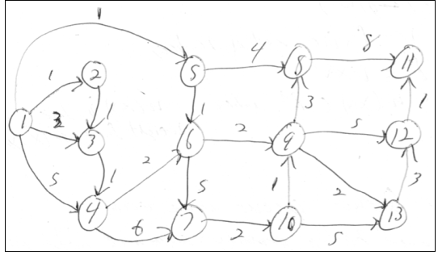
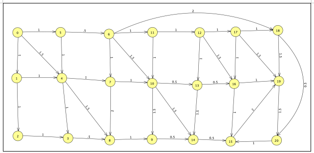

-------------------------------------------------
Programming Assignment 06 - Due 4/16 by 11:59 pm
-------------------------------------------------

## Description

For programming assignment 6 we will be implementing the classes related to a weighted graph.

1. `WeightedGraph`
2. `WeightedEdge`
3. `WeightedVertex`

## Classes you will Need

For this project you need to use a ***minimum*** `PriorityQueue<WeightedVertex>` using a comparator, `WeightedVertexComparator` that implements `java.util.Comparator<WeightedVertex>` for our implementation of ***Dijkstra's single source shortest path algorithm***. The `WeightedVertex` and `WeightedVertexComparator` should have been done in lab 7. We provide them here for you.

## Naming Convention

Similar to our previous assignments, please create a file, where you name your `WeightedGraph` class with a name of `your_last_name_in_lower_case_WeightedGraph`. Points will be deducted otherwise. The majority of your work will need to be done in this `WeightedGraph` class. The other files have basically been fully implemented for you already. 

## Start Code

The following files are provided:

1. `WeightedGraphReturnType.java`
    - enum which the programmer can use to disambiguate the type of return value for `getPath()`
        1. specify `HAS_PATH` to get ***whether there is a path*** between the ***from*** and ***to*** vertices
        2. specify `GET_MINIMUM_WEIGHT` to get the ***weight of a minimum cost path*** between the ***from*** and ***to*** vertices
        3. specify `GET_PATH` to get ***the path*** between the ***from*** vertex and the ***to*** vertex
2. `WeightedEdgeFunctions.java`
    - Interface that specifies the methods required for the `WeightedEdge` record
    - `public String toString();`
        1. Return a `String` representation of the edge in the form `“(x,y,w)”` where `x` is the ***from vertex***, `y` is the ***to vertex***, and `w` is the ***weight***
        2. **Note:** Throughout our code, we will use the compiler provided accessor methods for accessing the three fields of the record, [as discussed towards the bottom of this lecture](https://github.com/Binghamton-University-CS140-Spring-2023/lecture_notes/blob/main/12_more_on_inheritance.md).
3. `WeightedVertexFunctions.java`
    - Interface that specifies the methods required for the `WeightedVertex` class
    - `public double getWeight();`
        1. Get the ***weight (ie cost)*** of the `WeightedVertex`
    - `public int getVertex();`
        1. Get the ***vertex*** of the `WeightedVertex`
    - `public void setWeight(double w);`
        1. Set the ***weight*** of the `WeightedVertex`
        2. **Note:** The weight will be updated when finding a ***minimum cost path*** from the ***source vertex*** to the ***vertex*** in your implementation of ***Dijkstra's algorithm***
        3. If the weight is updated, the `WeightedVertex` object needs to be removed from the `PriorityQueue`, updated, and then put back in
            - This is so that the `PriorityQueue` maintains the proper order
        4. **Recall:** As part of lab 7, we saw that if you update the weight of a `WeightedVertex` without removing it from the `PriorityQueue`, then the elements in the `PriorityQueue` are not guaranteed to be in the correct order.
    - `public boolean equals(Object o);`
        1. Used by the `PriorityQueue<WeightedVertex>` when removing a `WeightedVertex`
        2. Returns `true` if `o.getVertex()` is equal to `this.getVertex()`
        3. Returns `false` otherwise
        4. Use `if( o instanceof WeightedVertex )` to determine if `o` is a `WeightedVertex` and then use `((WeightedVertex) o).getVertex()` to ***downcast*** to an object of type `WeightedVertex`
            - Or you can use `getClass()` to verify that `o` is of type `WeightedVertex`
        5. Verify that `o` is not `null` prior to doing anything with it
    - `public String toString()`;
        1. Return a `String` representation of the `WeightedVertex` in the form `“(x,w)”` where `x` is the ***vertex*** and `w` is the ***weight***
4. `WeightedGraphFunctions.java`
    - Interface that specifies the methods required for the `WeightedGraph` class
    - `public boolean hasPath(int fromVertex, int toVertex);`
        1. Returns `true` or `false` depending on ***whether there is a path*** from `fromVertex` to `toVertex`
    - `public double getMinimumWeight(int fromVertex, int toVertex);`
        1. Returns ***the cost of a minimum cost path*** from the `fromVertex` to the `toVertex`. Returns `Double.NaN` if there is no path.
    - `public WeightedEdge[] getPath(int fromVertex, int toVertex);`
        1. Returns ***a minimum cost path*** from the `fromVertex` to the `toVertex` if there is one – that is, it returns an ***ordered array*** of weighted edges from `fromVertex` to `toVertex`. Returns an `WeightedEdge[]` of `length` 0 if there is no path.
            - **Hint:** You can use a list first to build up how long the path is, then allocate an array with the appropriate length before populating the array.
    - `private Object getPath(int fromVertex, int toVertex, WeightedGraphReturnType typeOfInfo)`
        1. Method that does all of the work and is called by `hasPath()`, `getMinimumWeight()`, and `getPath()` with the `WeightedGraphReturnType` set to the appropriate value
        2. The appropriate result should be cast as an `Object` when returned to the calling method
        3. Your implementation of `WeightedGraph` needs to ***override*** this method
    - `public boolean addVertex(int v);`
        1. Add a vertex to the weighted graph
        2. If the vertex already exists, do not add it
    - `public boolean addWeightedEdge(int from, int to, double weight);`
        1. Add a weighted edge to the weighted graph
        2. If the weighted edge already exists, do not add it
            - That is, there already exists a weighted edge with the ***from*** and ***to*** vertices
    - `public String toString();`
        1. Return a `String` representation of the graph
            - Below is my output for “sample_weighted_graph_1.txt”

```
1. G = (V, E)
2. V = {1,2,3,4,5,6,7,8,9,10,11,12,13}
3. E = {(1,2,1.0),(1,3,3.0),(1,4,5.0),(2,3,1.0),(3,4,1.0),(1,5,1.0),(4,6,2.0),(5,6,1.0),(4,7,6.0),(6,7,5.0),(5,8,4.0),(6,9,2.0),(7,10,2.0),(8,11,8.0),(9,12,5.0),(9,13,2.0),(9,8,3.0),(10,13,5.0),(12,11,1.0),(13,12,3.0),(10,9,1.0)}
```

5. `WeightedVertexComparator.java`
    - Class that implements the `Comparator` interface
    - Used as the comparator for the `PriorityQueue<WeightedVertex>`

## Test Code

I've also included a copy of `testWeightedGraph.java`, which can read the definition of a weighted graph from a file, instantiate a copy of a `WeightedGraph`, and add the vertices and edges of the graph to the `WeightedGraph` object. It also calls the `hasPath()`, `getMinimumWeight()`, and `getPath()` methods of the `WeightedGraph`.

-----------------------------------
Lab 10 - Due 11 / 8 by 11:59 pm
-----------------------------------

Time to take a quick detour. Lab10 is basically just getting started on implementing program assignment 06, to help you ensure that your `WeightedGraph` class is being implemented correctly. [For lab10, please do all the details specified here, then push up your changes to github.](/lab10/README.md) The commit hash on brightspace should correspond to what you finish by the end of lab10:

```
git add -A
git commit -m "finished lab 10, rest of program assignment 06 will come later."
git push
git rev-parse HEAD
```

To be clear here, lab10 will be completely captured and graded here, in the program assignment 06 repository. There is no separate lab10 repository. Your grade for program assignment 06 will also be based upon this repository, just for another commit hash that you will submit later on, when you finish it in its entirety.

If you finish lab10 early in lab, you may continue on to implement the rest of programming assignment 06. See below.

# STOP! Do not continue below until you have finished lab 10 above

## Requirements

For this programming assignment, you need to implement the following classes:

1. `WeightedGraph` implementing `WeightedGraphFunctions`
    - Implement the methods specified by `WeightedGraphFunctions`
    - My implementation has three fields:
        - `private final java.util.ArrayList<Integer> vertices;`
            1. The list of vertices
        - `private final java.util.ArrayList<WeightedEdge> edges;`
            1. The list of edges
        - `private boolean debugOutput = false;`
            1. A boolean to control outputting debug information while implementing the class
            2. This is optional for you, but it might be helpful while trying to work out bugs as you develop.
    - Constructor
        - `WeightedGraph()`
    - Your class needs an implementation of ***Dijkstra's single source shortest path algorithm***, `getPath(int fromVertex, int toVertex, WeightedGraphReturnType typeOfInfo)` to support the `hasPath`, `getMinimumWeight`, and `getPath` methods
2. `WeightedEdge` implementing `WeightedEdgeFunctions`
    - Implement the methods specified by `WeightedEdgeFunctions`
    - This should have been done for you already.
    - If the record doesn't compile for you, an alternate has been provided, but is commented out. 
        - Opt for the record if you have a compiler that supports it.
3. `WeightedVertex` implementing `WeightedVertexFunctions`
    - Implement the methods specified by `WeightedVertexFunctions`
    - This class stores the ***cost of a minimum cost path*** from the ***source vertex*** to the ***vertex of the object***
    - My implementation has two fields
        - `private final Integer vertex;`
            1. The vertex of the `WeightedVertex`
        - `private Double weight;`
            1. The cost of a ***minimum weight path*** from the source vertex to the vertex
            2. **Note:** The weight is initially set to `Double.POSITIVE_INFINITY`
            3. The weight is updated as paths are found from the source vertex to the vertex of the object
            4. The weight is used by the `PriorityQueue<WeightedVertex>` to sort the `WeightedVertex` during ***Dijkstra's algorithm***
    - Constructor
        1. `WeightedVertex(int v, double w)`
    - You need to make sure that when external classes access the fields that they use the methods specified by the interface
        1. That is, they do not directly access the fields without using the ***get/set*** methods

## Dijkstra's Alorithm - Pseduo Code

Here is some **pseudo code** for ***Dijkstra's single source shortest path algorithm***:
1. **Note:** We will call the from vertex the ***source vertex*** and the to vertex the ***destination vertex*** in the discussion below.
2. Create a `PriorityQueue<WeightedVertex>`

``` java
java.util.PriorityQueue<WeightedVertex> minPriorityQueueByWeight = new java.util.PriorityQueue<>(vertices.size(), new WeightedVertexComparator());
```

3. Create a `WeightedVertex` array to keep a copy of the `WeightedVertex` objects in `minPriorityQueueByWeight`

``` java
WeightedVertex[] verticeCost = new WeightedVertex[vertices.size()];
```
- When removing the `WeightedVertex` associated with a vertex, I use the `WeightedVertex` stored in the `verticeCost` array associated with the vertex and the `minPriorityQueueByWeight.remove()` method
4. Create an `int` array to keep the parent of each vertex in a path from the source vertex

``` java
int[] parent = new int[vertices.size()];
```

5. Let's initialize the above data as follows.
    - Set the weight of each `WeightedVertex` to `Double.POSITIVE_INFINITY`, except for the ***source vertex***, set it's weight to `0` and put them in the `verticeCost` array
    - **Note:** Remember the vertex numbers and the vertex index in the vertices `ArrayList<Integer>` are not guaranteed to be the same
    - Set the parent of each vertex to `-1` (unassigned), except for the ***source vertex***, set it to itself
    - Here's what my code looks like:

``` java
for( int i = 0; i < vertices.size(); i++ )
{
    parent[i] = -1;
    verticeCost[i] = new WeightedVertex(vertices.get(i), Double.POSITIVE_INFINITY);
}

parent[fromVertexIndex] = fromVertex;
verticeCost[fromVertexIndex] = new WeightedVertex(vertices.get(fromVertexIndex), 0.0);
```

- Add all of the elements of `verticeCost` to `minPriorityQueueByWeight`

``` java
for( int i = 0; i < vertices.size(); i++ )
{
	minPriorityQueueByWeight.add(verticeCost[i]);
}
```

- **Note:** I have a method, `getIndex(Integer v)` that returns the index of the vertex `v` in my vertices `ArrayList`

6. `while ( minPriorityQueueByWeight.size() > 0 )`:
    - use `minPriorityQueueByWeight.poll()` to get the ***lowest cost element*** out of `minPriorityQueueByWeight`
    - Let `v` be the vertex of the element of `minPriorityQueueByWeight` returned by `poll()`
    - **Note:** If the `parent[v] == -1`, that means that all of the remaining vertices in `minPriorityQueueByWeight` are ***not reachable*** from the source vertex, so we can exit the while loop
    - **Note:** If `v` is the ***destination vertex***, we can also exit the while loop
    - loop over the edges of the graph:
        - If the current edge's from vertex == `v`:
            - Let the ***to vertex*** of the current edge be `u`
            - if the cost of `v` + edge weight of the current edge < current cost to `u`:
                - Update the cost to get to `u`
                - Remove the `WeightedVertex` for `u` from `minPriorityQueueByWeight`
                - Update the ***weight/cost*** for `u` to cost of `v` + edge weight of the current edge
                - Add the updated `WeightedVertex` for `u` back into `minPriorityQueueByWeight`
                - Update the parent of `u` to be `v`
7. Check to see if there is a path to the ***destination vertex***
    - If the parent array value for the destination vertex is not `-1`, then there is a path from the ***source vertex*** to the ***destination vertex***
    - **Note:** The weight of a minimum cost path from the ***source vertex*** to the ***destination vertex*** is the `WeightedVertex` element in `verticeCost` at the index associated with the destination vertex
    - To construct a path from the ***source vertex*** to the ***destination vertex***, we need to use the parent array to first get a ***reverse path*** from the destination to the source vertex, and then create a path from the source vertex to the destination vertex:
        - Let `p` be the destination vertex
        - Add `p` to `reversePath`
        - `while ( p != source vertex )`
            - Let `p` be the parent of the current `p`
                - Get the index of `p`, and then set `p` to `parent[indexOfP]`
                - Add `p` to `reversePath`
        - Now create a forward path from the source vertex to the destination vertex:

``` java
               for( int i = reversePath.size()-1; i >= 0; i-- )
               {
                   forwardPath.add(reversePath.get(i));
               }
```
- At this point, we have the sequence of vertices that take us from the ***source vertex*** to the ***destination vertex***. We need to create an array of edges: 
    - We want to create an `WeightedEdge` array of size `forwardPath.size()-1`
    - **Note:** The `i-th` element of the `WeightedEdge` array will be the edge from the `forwardPath` element at index `i` to the element at `i+1`

8. Your `getPath(int fromVertex, int toVertex, WeightedGraphReturnType typeOfInfo)` is to implement ***Dijkstra's single source shortest path algorithm***, and it returns an `Object`, based on which method (`hasPath`, `getMinimumWeight`, or `getPath`) called it, and the calling method ***downcasts*** the returned `Object` into the appropriate type


## Concrete Examples

Below are some concrete examples, `sample_weight_graph_1.txt` and `sample_weight_graph_2.txt`. These are located in the `sample_graphs` directory for testing purposes. There are also various other sample graphs that you can find in this folder. 

You will likely notice that examples 3/4 and 5/6 are basically identical, just a different arrangement of the Vertices. Your program should be able to handle vertices having values that don't correspond to where they reside in arrays, indice wise. This is why these examples are included, for you to ensure this is the case.

Samples 7 and 8 are purposely complex, and will be used during my testing to determine your grade. 

### Sample Weighted Graph 1

`sample_weighted_graph_1.txt` should equate to the following image:



Below is the output of my program (run from the `src` directory) for a couple of vertex pairs for `sample_weighted_graph_1.txt`:

```
    1) java testWeightedGraph ../sample_graphs/sample_weighted_graph_1.txt 1 7
        a) hasPathResult = true
        b) minimumWeightResult = 7.0
        c) minimumWeightPathResult = (1,5,1.0),(5,6,1.0),(6,7,5.0)
    2) java testWeightedGraph ../sample_graphs/sample_weighted_graph_1.txt 1 12
        a) hasPathResult = true
        b) minimumWeightResult = 9.0
        c) minimumWeightPathResult = (1,5,1.0),(5,6,1.0),(6,9,2.0),(9,12,5.0)
    3) java testWeightedGraph ../sample_graphs/sample_weighted_graph_1.txt 11 12
        a) hasPathResult = false
        b) minimumWeightResult = NaN
        c) minimumWeightPathResult = 
```

### Sample Weighted Graph 2

`sample_weighted_graph_2.txt` should equate to the following image:




Below is the output of my program (run from the `src` durectory) for a couple of vertex pairs for `sample_weighted_graph_2.txt`:

```
    1) java testWeightedGraph ../sample_graphs/sample_weighted_graph_2.txt 0 20
        a) hasPathResult = true
        b) minimumWeightResult = 4.0
        c) minimumWeightPathResult = (0,5,1.0),(5,6,0.5),(6,18,2.0),(18,20,0.5)
    2) java testWeightedGraph ../sample_graphs/sample_weighted_graph_2.txt 0 15
        a) hasPathResult = true
        b) minimumWeightResult = 5.0
        c) minimumWeightPathResult = (0,5,1.0),(5,6,0.5),(6,10,1.5),(10,13,0.5),(13,16,0.5),(16,15,1.0)
    3) java testWeightedGraph ../sample_graphs/sample_weighted_graph_2.txt 4 15
        a) hasPathResult = true
        b) minimumWeightResult = 3.5
        c) minimumWeightPathResult = (4,8,1.5),(8,9,1.0),(9,14,0.5),(14,15,0.5)
    4) testWeightedGraph ../sample_graphs/sample_weighted_graph_2.txt 11 7
        a) hasPathResult = false
        b) minimumWeightResult = NaN
        c) minimumWeightPathResult = 
```

## Submission

To submit your program, be sure to push your code up to github and submit your latest commit hash on BrightSpace.

```
git add -A
git commit -m "finished program assignment 6"
git push
git rev-parse HEAD
```