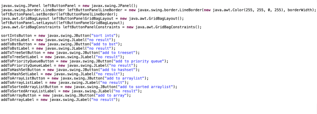
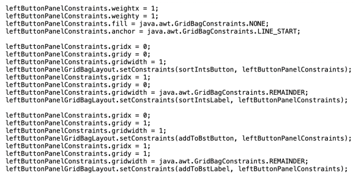
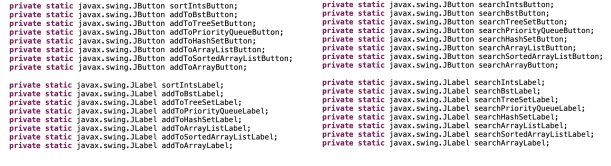
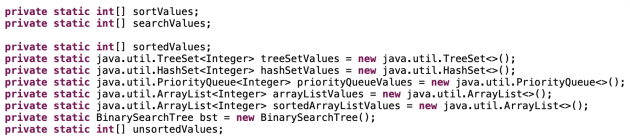
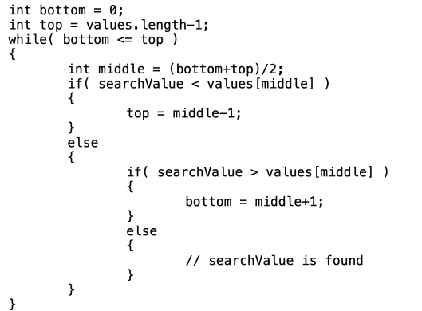

--------------------------------------------------
Program Assignment 08 - Due 5/4, by 11:59 pm
--------------------------------------------------

This is the final programming assignment for the semester. It will involve creating both a front end and back end.

Similar to previous assignments, there will also be a lab which will act as a starting point towards completing this assignment.

The final project is due at midnight on the last day of classes, 5/4/2023.
- But, I will accept submissions, for full credit, until midnight, on 5/10/2023.

Start by creating a file, `your_last_name_in_lower_case_p8.java`. It should reside within the `src` directory.

## Note about Border Colors

- You don't have to do the hideous black/red/yellow/turquoise border for the `JPanels` if you don't want to, the borders from the lab are fine. 
- But, if you've already replicated my colors, that's also fine.

## Note about program execution

- When you run the program, you should supply the sort file and search file as commandline parameters
- The sort file is the **first** commandline parameter
- The search file the **second** commandline parameter

## Program Functionality at a High Level

**Note:** For the discussion below, I may refer to the two `int[]` via different variable names than I used down below.  

- Your program will do the following:
1. Based on a menu item selection. read the sort file and populate an `int[] intsToSort` with the values read.
2. Based on a menu item selection, read the search file, and populate a separate `int[] intsToSearch` with the values read.
3. Based on a menu item selection. exit the program.

- Based on button clicks in the left panel:
1. Sort a deep copied `int[]` of the `intsToSort` using **selection sort**
2. Add key values to an initially empty BST for the values in `intsToSort`
	- **Note:** You may use a `TreeSet<Integer>` if your `insertNode()` and `getNode()` methods of your binary search tree are not working from PA5.
3. Add the values in `intsToSort` to an initially empty `TreeSet<Integer>`
4. Add the values in `intsToSort` to an initially empty `PriorityQueue<Integer>`
5. Add the values in `intsToSort` to an initially empty `HashSet<Integer>`
6. Add the values in `intsToSort` to an initially empty `ArrayList<Integer>`
7. Add the values in `intsToSort` to an initially empty `ArrayList<Integer>` and sort it using `java.util.Collections.sort`
8. Add the values in `intsToSort` to a separate `int[]`
9. Sort a copy of `intsToSort` using **merge sort** (optional for extra credit)  
	- **Note:** If the sort ints / add to buttons are clicked multiple times, you should either instantiate a new BST or clear out the data structure corresponding to the button (`TreeSet`/`PriorityQueue`/`HashSet`/`ArrayList`/`int[]`)

- Based on button clicks in the right panel:
1. Search for each of the `intsToSearch` values in the sorted, deep copied array of `intsToSort`, using your implementation of **binary search**
2. Search the BST for each of the key values in `intsToSearch`
3. Search the `TreeSet` for each of the key values in `intsToSearch`
4. Search the `PriorityQueue` for each of the key values in `intsToSearch`
5. Search the `HashSet` for each of the key values in `intsToSearch`
6. Search the `ArrayList` for each of the key values in `intsToSearch`
7. Search the `ArrayList` for each of the key values in `intsToSearch` using `java.util.Collection.binarySearch`.
	- **Note:** The binary search assumes the `ArrayList` has been sorted, which we have only done for one of the two `ArrayLists` populated via the left subpanel. Be sure you keep this distinction in mind.
8. Search the separate `int[]` for each of the key values in `intsToSearch` 
9. Search the merge sorted `int[]` for each of the key values in `intsToSearch` using a **binary search** (Optional for extra credit)

## Button Functionality - High Level

- The buttons in the left and right panels should initially all be disabled.
- When the sort file menu item is selected, and the sort file is read, the buttons associated with
sorting and adding should be enabled (ie the left panel)
- Each of the search buttons should be disabled until the search file is read **and** the applicable sort/add button is selected
- If the search file is read prior to a sort/add button being selected, then the corresponding search button is enabled when the sort/add button is selected
- If the sort/add button is selected prior to the search file being read, then the coprresponding
search button should be enabled when the search file is read

To accomplish this, I would recommend having boolean values associated with:
- each sort/add button (initially false, each set to true when the corresponding button is pressed)
- whether the sort file has been processed (initially false, set to true when the sort file is processed)
- whether the search file has been processed (initially false, set to true when the search file is processed)

The requirements above should drive what state checking you are doing with these booleans.

---------------------------------
Lab 12 - Due 4/18, by 11:59 pm
---------------------------------

Before you move on with the rest of Program Assignment 8, you will need to finish lab12. [For lab12, please do all the details specified here, then push up your changes to github.](/lab12/README.md) The commit hash on brightspace should correspond to what you finish by the end of lab12:

```
git add -A
git commit -m "finished lab 12, rest of program assignment 8 will come later."
git push
git rev-parse HEAD
```

To be clear here, lab12 will be completely captured and graded here, in the program assignment 08 repository. There is no separate lab12 repository. Your grade for program assignment 08 will also be based upon this repository, just for another commit hash that you will submit later on, when you finish it in its entirety.

If you finish lab12 early in lab, you may continue on to implement the rest of programming assignment 08. See below.

# STOP! Do not continue below until you have finished lab 12 above

## Description

- For program assignment 8, we will be reading two files of integer values.
	- The first file is the "sort" file
	- The second file is the "search" file
- When the files are read, the values are added to two `int` arrays.
	- In my code, I read the values into an `ArrayList<Integer>`, and once the entire file was read, my code copies the values into the appropriate `int[]`.

## Revisiting Selection Sort

- For programming assignment 1, we implemented selection sort to sort a `String[]`. 
- We will be re-using that method, except we will be updating it to sort an `int[]`.
- This update should be easy.
	- Replace `String[]` with `int[]`
	- Assuming the `String[]` is named `values`:
		- Replace `if(values[j].compareTo(values[min]) < 0)` with `if(values[j] < values[min])`
- That should be pretty much it.

## Part one

The first part of the remainder of the program is to ***evaluate various performances*** of sorting an array `int[] values` and also copying values into different data structures.

- Sort an `int[]` using the selection sort that we implemented in program one. `O(n^2)`.
- Add the values as keys into a binary search tree `O(n log n)`
- Add the values to a TreeSet `O(n log n)`
- Add the values to a PriorityQueue `O(n log n)`
- Add the values to a HashSet `O(n)`
- Add the values to an ArrayList `(unsorted, O(n))`
- Add the values to an ArrayList and use the `java.util.Collections.sort` to sort the values. `O(n log n)`
- Add the values to an `int[]` `(unsorted, O(n))`

- **Note:** Other than the `HashSet`, the `ArrayList` (unsorted), and `int[]` (unsorted), each of the above data structures will have sorted the data either while adding it or after adding it
- **Our Goal:** Keep track of the time spent performing each of the above.

## Part two

The second part of the remainder of the program is to ***evaluate various performances*** of searching for elements within difference data structures.

- Search for a value in a `int[]` smartly.
	- `O(log n) for each search`
	- Implement a binary search
- Search for a value in a Binary Search Tree 
	- `O(log n) for each search`
	- This is fast and easy, use the `getNode()` method
- Search for a value in a TreeSet 
	- `O(log n) for each search`
	- This is fast and easy, use the `contains()` method
- Search for a value in a PriorityQueue 
	- `O(n) for each search.`
	- This is slow, even though the PriorityQueue uses a heap to store the values, and the polling is quick, using the `contains()` method is very slow (and documented as such).
	- **Note:** Keep in mind, heaps are primarily used to quickly grab the next value from the priority queue, and was not optimized for searches.
- Search for a value in a HashSet
	- `O(log n)` garaunteed for each search, this might be `O(1)`
		- This is fast and easy, use the `contains()` method.
- Search for a value in an `ArrayList` in a naive way
	- `O(n)` for each search
	- This is slow, use the `contains()` method.
- Search for a value in an `ArrayList` in a smarter way.
	- `O(log n)` for each search.
	- This is fast, use the `java.util.Collections.binarySearch`
- Search for a value in a `int[]` naively.
	- `O(n)` for each search.
	- This is slow, use a for loop to search.

## Program Description

As you already saw from lab12, the program has a GUI component (our front end) and a non-GUI component (our backend).

Focusing on the non-GUI component, we will:
- Read the two files
- Create various data structures
- Populate the data structures
- Search for values in the data structures
- Track the time to do the various tasks.
- Report the number of search elements found in the various data structures

## Front end slides 

[Please refer to these slides showcasing what is happening in the front end for our GUI.](front_end_slides.pdf)

## Quick note about Threading Back end and Front End Separately 

Generally, when you create a GUI, if any of the work behind the GUI is going to take time, the GUI and the back end computations are done in separate threads.

- This stops the GUI from freezing while waiting for the back end computations to complete.
- Generally speaking, anything that takes more than 10 - 20 ms is long enough that the delay might be noticable to a typical user.

- **Note:** We are NOT going to deal with this issue for our program.
- When you select the `sort ints`, `search arraylist`, `search priority queue`, and `search array` for the larger test files, you will definitely notice that the GUI will temporarily freeze while waiting for the computations to complete.
- Sorting the 100,000 value file with selection sort takes around 3.5 seconds on my laptop, and the `250,000` value file takes around 23 seconds.

## Back end details

### The GridBagLayout manager

- This is fairly complex. 
- Here is what my code looks like for the `leftButtonPanel`:
	- Instantiate the panel
	- Instantiate the `GridBagLayout`
	- Set the layout of the panel
	- Instantiate the left buttons and panels.



### Adding buttons and labels to the left panel

Here is whay my code looks like for the first couple of buttons and labels being added to the leftButtonPanel:



### Requirements regarding State Management for your front end

- For my `JButtons` and `JLabels`, I declare them as `static` fields in the class, and when initially instantiated, the `JButtons` are disabled.
- When the input files are read, I enable the appropriate `JButtons`.
	- Refer back to the front end slides for more details, but it should be intuitive.
	- The search buttons are enabled when both the search file is read and the correspnding "sort/add" button is selected.
		- Your code needs to handle both cases where the search file is read ***BEFORE*** and ***AFTER*** the corresponding "sort/add" button is selected.
- Each of the `JButtons` need to have an `ActionListener` defined for it. 
	- See `example2a.java`
- All of my code is in a single file. This is not required, but it does work.
	- Except for the binary search tree code, which I re-used from program 5.

### Here is a list of all the methods implemented in my code.

1. `private static void selectionSort()`
2. `private static int searchInts()`
3. `private static void addToBinarySearchTree()`
4. `private static int searchBinarySearchTree()`
5. `private static void addToTreeSet()`
6. `private static int searchTreeSet()`
7. `private static void addToHashSet()`
8. `private static int searchHashSet()`
9. `private static void addToPriorityQueue()`
10. `private static int searchPriorityQueue()`
11. `private static void addToArrayList()`
12. `private static int searchArrayList()`
13. `private static void addToSortedArrayList()`
14. `private static int searchSortedArrayList()`
15. `private static void addToArray()`
16. `private static int searchArray()`
17. `private static void readData(String filename, boolean readSortValues)`

### Here are the two inner classes that I use (see example2a.java)

1. `static class MenuItemActionListener implements java.awt.event.ActionListener`
2. `static class ButtonActionListener implements java.awt.event.ActionListener`

### Here is a cross refernece between my buttons and the functions

| Button | Function |
| ------ | -------- |
| sort ints       			| `private static void selectionSort()` |
| add to bst       			| `private static void addToBinarySearchTree()` |
| add to treeset       		| `private static void addToTreeSet()` |
| add to priority queue     | `private static void addToPriorityQueue()`  |
| add to hashset       		| `private static void addToHashSet()` |
| add to arraylist       	| `private static void addToArrayList()` |
| add to sorted arraylist   | `private static void addToSortedArrayList()` |
| add to array       		| `private static void addToArray()` |
| ------------------------- | ---------------------------------- |
| search sorted ints       	| `private static int searchInts()` |
| search bst       			| `private static int searchBinarySearchTree()` |
| search treeset       		| `private static int searchTreeSet()` |
| search priority queue     | `private static int searchPriorityQueue()` |
| search hashset       		| `private static int searchHashSet()` |
| search arraylist       	| `private static int searchArrayList()` |
| search sorted arraylist   | `private static int searchSortedArrayList()` |
| search array       		| `private static int searchArray()` |

- And the two menu items both use `private static void readData(String filename, boolean readSortValues)`

### Here are my button and label declarations

- Since they are fields of the class, they can be accessed directly by the methods in the class. 
	- This will be useful when needing to enable buttons as the state changes.
- They can't be access directly by the inner classes of the main class, but they can be accessed if we pass them as a paramter of the inner class constructor.
	- See example2a.java
- You don't need to use my variable names, they are just to show you an example of what I did.



### Here are my data storage declarations

| Field | Description |
| ----- | ----------- |
| `int[] sortValues`   							| contains the list of values read from the “sort file”   |
| `int[] searchValues` 							| contains the list of values read from the “search file” |
| `int[] sortedValues` 							| is the array that is sorted in selectionSort() | 
| `TreeSet<Integer> treeSetValues` 				| is the tree set used for adding to and searching |
| `HashSet<Integer> hashSetValues>` 			| is the hash set used for adding to and searching |
| `PriorityQueue<Integer> priorityQueueValues` 	| is the priority queue used for adding to and searching |
| `ArrayList<Integer> arrayListValues` 			| is the unsorted ArrayList used for adding to and searching |
| `ArrayList<Integer> sortedArrayListValues` 	| is the sorted ArrayList used for adding to and searching |
| `int[] unsortValues` 							| is the unsorted `int[]` used for adding to and searching |
| `BinarySearchTree bst` 						| is the binary search tree used for adding to and searching |



### Getting the time estimates

To get the time estimates, simply capture the time just before and just adter calling the various methods:


``` java
long t0 = System.currentTimeMillis();
long t1 = System.currentTimeMillis();
```

The set the text to `(t1 - t0) + "ms"` for the appropriate label.

### How to implement the ActionListeners

- For the two `ActionListeners`, in their `actionPerformed()` methods, I have a collection of `if` statements to determine which button or menu item was selected, and then call the appropriate method to perform the required action.
	- See example2a.java

- The vast majority of my code is related to the GUI.
- The other code, reading the input files, and adding/sorting/searching for values is quite small in comparison.
	- For the TreeSet, HashSet, unsorted ArrayList, and PriorityQueue, we are just using the `add()` and `contains()` methods.
	- For the binary search tree, we are just doing the `insertNode()` and `getNode()` methods.

### Requirements for the search labels

- The search methods return the number of values found
- The label associated with the “search” buttons are updated with the number of search values found and the time spent searching for them.
	- **Note:** The labels should have `X / Yms` after performing the search
	- Where `X` is the number of values found in the search and `Y` is the number of milliseconds to perform the search

### Implementing the Binary search 

The following code assumes that you are dealing with an already sorted array:



## Nice work.

If you made it to the end, congratulations! Developing front end and back end is no small feat, especially for an intro course. 

## Extra credit

If you wish, you can try to do a ***merge sort*** for ***10 extra points of extra credit***.

- [I have also posted some expected results, which you can find here.](expected_results_and_extra_credit.pdf)

## Submission

Submit your finished program to github and post the latest commit hash on BrightSpace.

```
git add -A
git commit -m "finshed program assignmnent 08"
git push
git rev-parse HEAD
```

## Grading Details

Recall PA8 is worth more of your overall grade than the other program assignments we have done. So make sure you put your best effort forward. 

When I grade your program: 
- I will be copying your files into a folder
- Execute `javac your_last_name_in_lower_case_program8.java` or `javac your_last_name_in_lower_case_p8.java`
- Execute `java your_last_name_in_lower_case_program8 sort_data_100000.txt search_data_100000.txt` or `java your_last_name_in_lower_case_p8 sort_data_100000.txt search_data_100000.txt`
- Click buttons and menu items

### Note on use of packages

- If your program doesn't compile:
- Make sure that you **DO NOT** use a package
- That will cause it to not compile (or actually change the command to run it)

### Double check your file names

- Make sure all of your filenames and class names are correct
- So that your program compiles

- Here are the files in my submission
1. bailey_p8.java
2. BinarySearchTree.java
3. BinarySearchTreeFunctions.java
4. Node.java
5. NodeFunctions.java

## Reminder about Inner Classes

- If you look at the class files that are created when we compile the program, there are two class files related to our inner classes. Mine would be:
	- bailey_p8$ButtonActionListener.class
	- bailey_p8$MenuItemActionListener.class
- This is completely expected.

### Make sure your code compiles and is executable

- Before you submit, try compiling and executing from the commandline with the files that you are submitting
- Decent points will be deducted otherwise

### What I will be focused on during testing

While testing your program, I will be checking:
1. Are your times similar to mine for the sorting and adding buttons?
2. Are your times similar to mine for the searching buttons?
3. Are the number of found search values the same as mine?
4. Are your buttons enabled/disabled appropriately?
5. Do you have the correct menu items and are they in the correct order?
6. Do you have one menu and is it “file”?

- **Note:** There shouldn't be any major shocks about what your grade for the program is.
