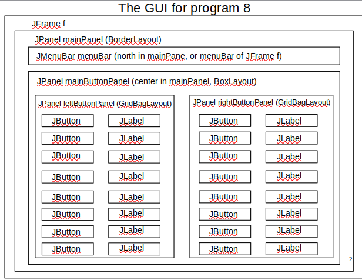
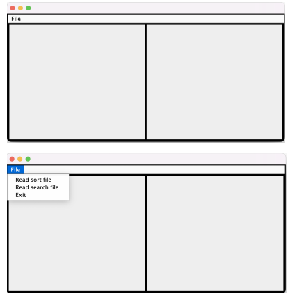
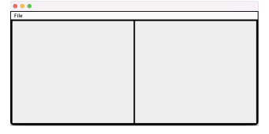
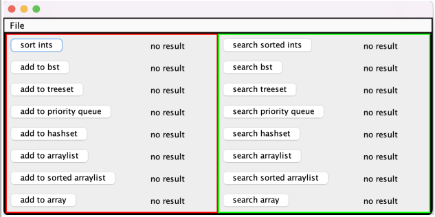

---------------------------------
Lab 12 - Due 4/18, by 11:59 pm
---------------------------------

For lab 12, you will get started on the front end GUI (Graphical User Interface).
- You don't need to finish it, but you want to make significant progress on it.

If you have not already done so, create a file, `your_last_name_in_lower_case_p8.java`.
It should reside within the `src` directory.

## GUI Design 

We will be building up a GUI which looks like this:




The majority of the functionality can be found in the `supplementary/examples` directory of the lecture_notes repository. In particular, refer back to the `swing` directory.

1. [Here are the swing lecture notes for reference.](https://github.com/Binghamton-University-CS140-Spring-2023/lecture_notes/blob/main/33_swing.pdf)
2. [Here are the swing examples in the supplementary directory.](https://github.com/Binghamton-University-CS140-Spring-2023/lecture_notes/tree/main/supplementary/examples/swing)

In particular, focus on the following examples:

1. `example4c.java`
	- `JMenuBar`
	- `Jmenu`
	- `JMenuItem`
	- `GridBagLayout`
	- `GridBagConstraints`
	- `BorderLayout`
	- `ActionListeners`
		- for `JMenuItems` and `JButtons`

2. `example4.java`
	- `BoxLayout`
		- `buttonPanel` uses a `BoxLayout`

## Tailoring the JPanels

For the `JPanels`, add a 2 pixel wide black border, so the TA / CAs can see the borders.

``` java
panel.setBorder(new javax.swing.border.LineBorder(new java.awt.Color(0,0,0,255), 2));
```

**Note:** `(0,0,0,255)` is black with 0% transparency. 

## The main method

Within a main method, do the following:

1. Create the `JFrame`
	- Set min, max, and preferred sizes to `700 x 350`
		- This should be sufficient to hold all of the buttons and labels
	- Set the default close operation to exit on close.
2. Create the `JMenuBar`
	- Create the "File" `JMenu`
		- Create the "Read sort file" `JMenuItem`
		- Create the "Read search file" `JMenuItem`
		- Create the "Exit" `JMenuItem`
	- Create the `MenuItemActionListeners` for the three `JMenuItems`
		- **Note:** Details on the implementation can be found below, dealing with what we do outside the main method.
	- Add the `ActionItemListeners` to the three `JMenuItems`
	- Add the "File" menu to the menu bar
	- Add the three menu items to the "File" menu
3. Create the left button panel
	- Add a 2 pixel wide black border to the panel
	- Create a `GridBagLayout` and set it as the layout of the panel
	- Set the preferred and min size to `330 x 350`
4. Create the right button panel
	- Add a 2 pixel wide black border to the panel
	- Create a `GridBagLayout` and set it as the layout of the panel
	- Set the preferred and min size to `330 x 350`
5. Create the main button panel
	- Add a 2 pixel wide black border to the panel
	- Create a `BoxLayout` and set it as the layout of the panel
		- `example4.java` uses a `BoxLayout`
	- Add the left and right button panels to the main button panel
6. Create the main panel
	- Add a 2 pixel wide black border to the panel
	- Create a `BorderLayout` and set it as the layout for the panel
	- Add the main button panel to the panel as the center component
7. Set the frame's content pane to the main panel
8. Validate the frame
9. Set the fram to visible.	

## Outside the main method

For the following, see `example2a.java` for reference.
Add the following two static nested classes:

1. `MenuItemActionListener`
	- Implement the action performed method:
		- If the "Exit" menu item is selected, output "exit" and exit the program.
		- If the "Read sort file" menu item is selected, output "read sort file"
			- **Note:** Later on in program assignment 8, you will be reading the input file containing the values to store/sort in various data structures.
		- If the "Read search file" menu item is selected, output "read search file"
			- **Note:** Later on in program assignment 8, you will be reading the input file containing the values to search for in various data structures.
2. `ButtonActionListener`
	- Implement the action performed method:
		- For now, simply print which button was pressed that drove the action performed method to be called.

## Front End so far

At this point, you should have something that looks like the below:



## Adding the buttons and labels

Once you have all the above working, if there is still time, start working on the buttons and labels.

You need ***eight*** buttons and labels for each of the left and right button panels.
- Declare all your buttons and labels as static fields in your class.
	- So that they can be accessed by any method on the class.
- When you do the `GridBagConstraints`, you should use:
	- `fill = NONE`
	- `anchor = LINESTART`
	- This will cause the buttons to align on the left and not fill in any empty space.

If you have the GUI completed, you can also work on program assignment 8 functionality. The further you get during lab, the more you are setting yourself up for success.

## Getting credit

Demonstrate to a TA/CA your GUI. Execute your program. You should have something that looks like the below at a minimum. (You may additionally have some labels and buttons).



- Show that the "File" menu is populated appropriately.
- Show that the three menu items are functional.
	- "Functional" means they output something to the commandline when clicked, and the "Exit" menu item exists the program.


## Expected GUI with buttons and labels

For those that wish to compare, here is what mine looks like with the buttons and labels populated (but not functional).
- **Note :** The red and green colors are just there for the sake of clarity, to show where the left and right button panels are. You don't need to (and should not) replicate my colors.



## Submit Lab 12

Submit your work so far to github, and post the latest commit hash to BrightSpace for lab12:

```
git add -A
git commit -m "finished lab12, reset of program assignment 8 to come later"
git push 
git rev-parse HEAD
```
## Back to Program Assignment 8

[This will take you back to the README for program assignment 8.](../README.md)
